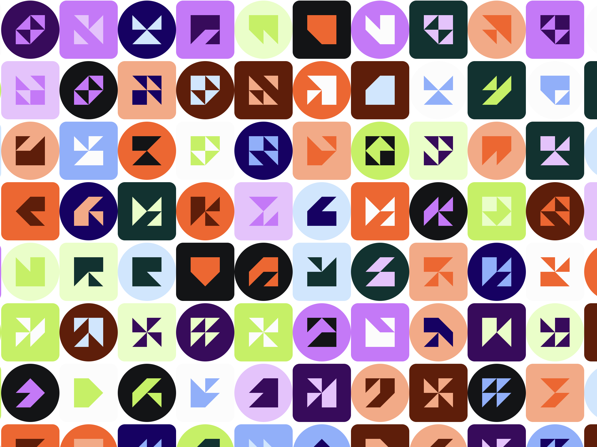

# maskicon

An identicon generator in the style of the MetaMask brand system.



## Usage

```js
// makes a square of size 100 
const jazzicon = require('maskicon')
const el = jazzicon('0x4EBee6bA2771C19aDf9AF348985bCf06d3270d42')
document.body.appendChild(el)

// makes a circle of size 250
const jazzicon = require('maskicon')
const el = jazzicon('0x4EBee6bA2771C19aDf9AF348985bCf06d3270d42', 250, true)
document.body.appendChild(el)
```
